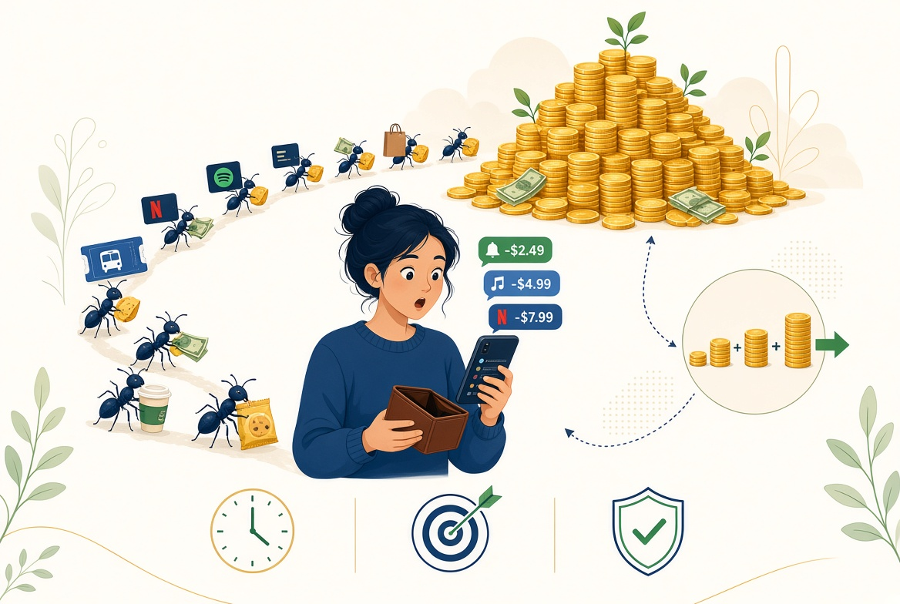

A primera hora de la mañana un café para llevar, al mediodía una suscripción digital que apenas usas, por la tarde un antojo en la aplicación de comida a domicilio. Pequeños desembolsos cotidianos que parecen inofensivos, pero que al cabo de los meses se acumulan y le dan una sorpresa amarga al final de año. Si esta situación te resulta familiar, es muy probable que no tengas un problema de ingresos, sino de gastos hormiga.

## Qué son exactamente los gastos hormiga

Los gastos hormiga son esos pequeños desembolsos cotidianos —un café diario, una suscripción fantasma, comisiones bancarias innecesarias o pequeños caprichos impulsivos— que, tomados de forma individual, parecen insignificantes. Sin embargo, su verdadero peligro radica en la constancia: sumados al final del mes y del año, representan una cantidad de dinero alarmante que podría estar destinada al ahorro o la inversión.

## Ejemplos cotidianos que pasan desapercibidos

Para solucionar un problema primero hay que ponerle nombre y detectarlo. Estos son los escenarios más comunes donde se esconden:

* **El café y la bollería diaria:** Ese gasto de 2,50 € o 3 € antes de entrar a trabajar parece inofensivo, pero multiplicado por 20 días laborables se convierte en más de 50 € al mes.
* **Suscripciones fantasma:** Plataformas de streaming, aplicaciones móviles o servicios en la nube que pagas mes a mes pero que apenas utilizas.
* **Comisiones bancarias:** Mantenimiento de cuentas, tarjetas o descubiertos que se pueden evitar fácilmente cambiando de entidad o digitalizando la operativa.
* **Pedidos a domicilio impulsivos:** Esos días de pereza en los que pides comida sumando tarifas de envío y servicio que multiplican el coste real del plato.

## El impacto real a final de año

La psicología humana tiende a subestimar los gastos pequeños porque no duelen en el momento del pago. Gastar 4 € en una aplicación o un tentempié no activa las alarmas mentales de la misma manera que ver salir 120 € de golpe. No obstante, si multiplicas 4 € diarios por 365 días, el resultado son **1.460 € al año** evaporados sin dejar rastro de valor real a cambio.

## Cómo identificar y eliminar tus gastos hormiga paso a paso

1. **Auditoría de extractos:** Revisa los movimientos de tus tarjetas del último mes y señala con un rotulador o marca digital todos los micropagos inferiores a 10 €.
2. **La regla de las 48 horas:** Aplica un periodo de espera obligatorio antes de contratar cualquier suscripción o servicio digital recurrente.
3. **Automatiza el ahorro:** Transfiere tu capacidad de ahorro a una cuenta separada el mismo día que cobras la nómina. Lo que no está disponible en la cuenta corriente principal, no se gasta en hormigas.